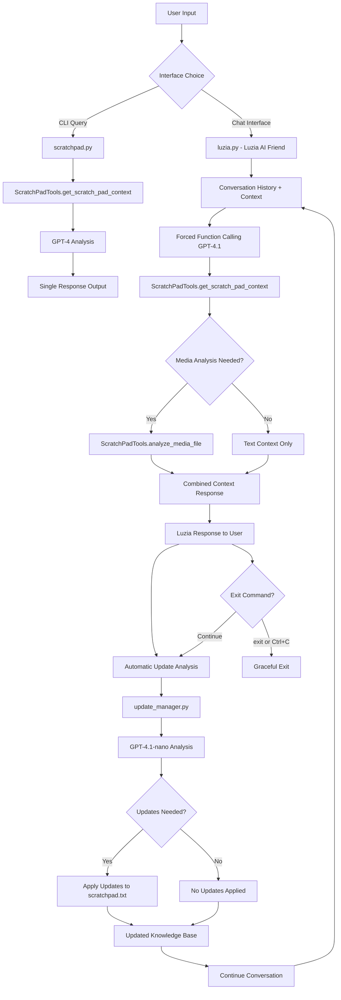

# Scratch Pad AI Tool

A sophisticated personal knowledge assistant that evolved through multiple phases to become your intelligent AI companion. The system processes queries using your personal scratch pad document and provides contextual responses through multiple interfaces, with automatic knowledge base updates.

## 🌟 Features

### Multi-Interface Support
- **CLI Interface** (Phase 1): Quick command-line queries for immediate answers
- **Luzia Chat Interface** (Phase 2): Conversational AI friend with personality and memory
- **Dynamic Updates** (Phase 5): Automatic scratchpad updates based on conversations

### Advanced AI Capabilities
- **Intelligent Context Extraction**: Uses GPT-4.1 to find relevant information from your knowledge base
- **Function Calling Architecture**: Forced function calls ensure reliable data retrieval
- **Enhanced Media Processing**: Automatic visual analysis when needed
- **Conversation Memory**: Maintains context throughout chat sessions
- **Smart Updates**: AI-driven scratchpad updates with PII protection

### Developer-Friendly Features
- **Colored CLI Output**: Visual feedback with trace mode for debugging
- **Debug Context**: Automatic saving of LLM interactions for troubleshooting
- **KISS Error Handling**: Simple, clear error messages
- **Configurable Prompts**: Easily customizable system behavior

## 🏗️ System Architecture



### Key System Components

1. **Function Calling Tools** (`tools.py`): Core AI functions for context extraction and media analysis
2. **Conversational Interface** (`luzia.py`): Your AI friend with personality and continuous chat
3. **Update Management** (`update_manager.py`): Intelligent scratchpad updates based on conversations
4. **Configuration System**: Customizable prompts and PII protection rules

## 📁 Project Structure

```
scratch_pad_tool/
├── .env                           # API key configuration
├── .env.template                  # Environment template
├── config/
│   ├── system_prompt.txt          # Main AI behavior configuration
│   ├── update_analysis_prompt.txt # Update decision logic
│   └── no_update.txt             # PII protection rules
├── media/                         # Referenced media files
│   ├── dni.png                   # Example: ID document
│   └── gorilla.png               # Example: Artwork
├── scratchpad.py                 # CLI interface (Phase 1)
├── luzia.py                      # Conversational AI (Phase 2)
├── tools.py                      # Function calling system
├── update_manager.py             # Dynamic updates (Phase 5)
├── scratchpad.txt               # Your personal knowledge base
├── requirements.txt             # Python dependencies
└── README.md                   # This documentation
```

## 🚀 Setup

### 1. Install Dependencies

```bash
pip install -r requirements.txt
```

### 2. Configure Environment

1. Copy the environment template:
   ```bash
   cp .env.template .env
   ```

2. Edit `.env` and add your OpenAI API key:
   ```bash
   OPENAI_API_KEY=your_actual_openai_api_key_here
   ```

### 3. Customize Your Knowledge Base

Edit `scratchpad.txt` with your personal information:

- **MEDIA DOCUMENTS**: Add file paths, descriptions, and summaries
- **USER FACTS**: Personal information, preferences, projects
- **CURRENT STATE**: Ongoing activities, recent updates

### 4. Configure System Behavior (Optional)

- **`config/system_prompt.txt`**: Modify AI behavior and response style
- **`config/update_analysis_prompt.txt`**: Customize update decision logic
- **`config/no_update.txt`**: Adjust PII protection rules

## 💬 Usage

### Luzia Chat Interface (Recommended)

Start an interactive conversation with your AI friend:

```bash
python luzia.py
```

**Features:**
- Continuous conversation with memory
- Automatic context retrieval
- Smart media analysis when needed
- Dynamic scratchpad updates
- Colored output with trace information
- Graceful exit (`exit` command or Ctrl+C)

**Example Chat:**
```
💭 Luzia: Hey! I'm Luzia, your AI friend. What's up?

You: What's my date of birth?
🔧 [TOOL] Getting scratch pad context for: What's my date of birth?
📄 [CONTEXT] Found relevant information in scratch pad
💭 Luzia: Your date of birth is February 12, 1987! 🎂

You: What projects am I working on?
🔧 [TOOL] Getting scratch pad context for: What projects am I working on?
📄 [CONTEXT] Found relevant information in scratch pad
💭 Luzia: You're working on the scratch pad AI tool project! ...

You: exit
👋 Luzia: Bye! Take care! 💚
```

### CLI Interface (Quick Queries)

For one-off questions:

```bash
python scratchpad.py "What are my current AI projects?"
```

**Options:**
```bash
# Custom scratch pad file
python scratchpad.py -f my_other_scratchpad.txt "What's my age?"

# Custom system prompt
python scratchpad.py -p custom_prompt.txt "Tell me about my artwork"

# Verbose mode
python scratchpad.py -v "What's my date of birth?"
```

## 🧠 How It Works

### Phase 1: Foundation (CLI)
Simple query-response system using GPT-4 for context extraction.

### Phase 2: Conversational AI
- **Luzia Persona**: Fun, helpful friend with brief, natural responses
- **Function Calling**: Forced GPT-4.1 function calls ensure reliable data access
- **Two-step Process**: Context extraction → optional media analysis
- **Conversation Memory**: Maintains context throughout the session

### Phase 3: Dynamic Updates
- **Automatic Trigger**: Runs after each conversation cycle
- **Smart Analysis**: GPT-4.1-nano evaluates what should be updated
- **PII Protection**: Comprehensive restrictions on sensitive information
- **Quality Control**: LLM-driven decision making for meaningful updates

### Update Analysis Process

The system automatically analyzes conversations for:
- **Explicit Corrections**: Direct factual updates or corrections
- **New Information**: Meaningful personal or project updates  
- **Status Changes**: Project progress, life events, preferences
- **Context Enhancement**: Information that improves future responses

**PII Protection** prevents updates of:
- Sexual preferences or content
- Medical information
- Financial details
- Security credentials
- Temporary emotional states
- Inappropriate content

### Colored Output System

- 🔧 **Cyan**: Function calling and tool usage
- 📄 **Blue**: Context and media analysis
- 💭 **Green**: Luzia responses
- ⚠️ **Yellow**: Update recommendations
- ✅ **Green**: Successful updates
- ❌ **Red**: Errors and failures

## 🔧 Technical Details

### Function Calling Architecture
```python
# Core functions available to AI
tools = [
    {
        "name": "get_scratch_pad_context",
        "description": "Get relevant context from user's scratch pad",
        "required": True  # Always called
    },
    {
        "name": "analyze_media_file", 
        "description": "Analyze media files when needed",
        "required": False  # Called when recommended
    }
]
```

### Conversation Flow
1. User input → GPT-4.1 with forced function calling
2. `get_scratch_pad_context(query)` called automatically
3. If media analysis recommended → `analyze_media_file(path)` called
4. Response generated with full context
5. Update analysis runs automatically
6. Scratchpad updated if needed
7. Conversation continues

### Update Decision Logic
The system uses sophisticated prompts to decide updates based on:
- **Explicit corrections**: "Actually, my birthday is..."
- **New meaningful info**: Project updates, life changes
- **Conversation context**: Natural information sharing
- **Quality thresholds**: Avoiding trivial or repetitive updates

## 🛠️ Error Handling

Following KISS principles:
- **Missing API key**: Clear setup instructions
- **File not found**: Helpful error messages  
- **API failures**: Simple error reporting
- **Malformed queries**: Graceful fallbacks
- **Update failures**: Non-blocking error logging

## 🔮 Future Enhancements

- **Multi-user Support**: File paths already parameterized
- **Web Interface**: Browser-based chat interface
- **Voice Integration**: Speech-to-text and text-to-speech
- **Plugin System**: Extensible tool architecture
- **Cloud Sync**: Multi-device scratchpad synchronization
- **Analytics**: Usage patterns and improvement insights

## 🤝 Contributing

This is a personal productivity tool, but suggestions and improvements are welcome! The system is designed to be extensible and modular.

## 📄 License

This project is for personal use and experimentation with AI-powered productivity tools.

---

*Your personal AI companion that learns and grows with you* 🤖💚 