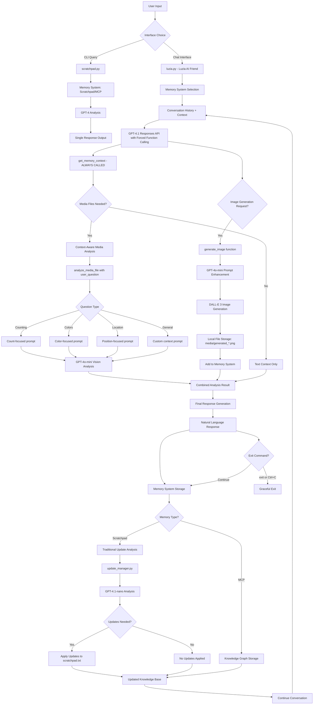

# Scratch Pad AI Tool

A sophisticated personal knowledge assistant that evolved through multiple phases to become your intelligent AI companion. The system processes queries using your personal scratch pad document and provides contextual responses through multiple interfaces, with automatic knowledge base updates and advanced image generation capabilities.

## 🌟 Features

### Multi-Interface Support
- **CLI Interface** (Phase 1): Quick command-line queries for immediate answers
- **Luzia Chat Interface** (Phase 2): Conversational AI friend with personality and memory
- **Dynamic Updates** (Phase 5): Automatic scratchpad updates based on conversations
- **Memory Systems**: Choice between Scratchpad and MCP Knowledge Graph memory

### Advanced AI Capabilities
- **Intelligent Context Extraction**: Uses GPT-4.1 to find relevant information from your knowledge base
- **Function Calling Architecture**: Forced function calls ensure reliable data retrieval
- **Context-Aware Media Analysis**: Vision analysis adapted to specific user questions
- **DALL-E Image Generation**: Create images with automatic prompt enhancement
- **Conversation Memory**: Maintains context throughout chat sessions
- **Smart Updates**: AI-driven scratchpad updates with PII protection

### Developer-Friendly Features
- **Colored CLI Output**: Visual feedback with trace mode for debugging
- **Debug Context**: Automatic saving of LLM interactions for troubleshooting
- **KISS Error Handling**: Simple, clear error messages
- **Configurable Prompts**: Easily customizable system behavior

## 🏗️ System Architecture



### Key System Components

1. **Tool Manager** (`tools/tool_manager.py`): Unified interface for all AI functions and tool coordination
2. **Memory Systems**: 
   - **Scratchpad Memory** (`tools/scratchpad_memory.py`): File-based personal knowledge storage
   - **MCP Memory** (`tools/mcp_memory.py`): Knowledge graph-based memory with visual exploration
3. **Image Generation** (`tools/image_tools.py`): DALL-E 3 integration with prompt enhancement
4. **Context-Aware Media Analysis** (`tools/media_tools.py`): Vision analysis adapted to user questions
5. **Conversational Interface** (`luzia.py`): Your AI friend with personality and continuous chat
6. **Update Management** (`update_manager.py`): Intelligent scratchpad updates based on conversations
7. **Configuration System**: Customizable prompts and PII protection rules

## 📁 Project Structure

```
scratch_pad_tool/
├── .env                           # API key configuration
├── .env.template                  # Environment template
├── config/
│   ├── system_prompt.txt          # Main AI behavior configuration
│   ├── update_analysis_prompt.txt # Update decision logic
│   ├── no_update.txt             # PII protection rules
│   └── mcp_config.json           # MCP memory system configuration
├── tools/                         # Modular tool system
│   ├── __init__.py               # Tool exports
│   ├── tool_manager.py           # Unified tool coordinator
│   ├── memory_manager.py         # Memory system selector
│   ├── memory_interface.py       # Abstract memory interface
│   ├── scratchpad_memory.py      # File-based memory system
│   ├── mcp_memory.py             # Knowledge graph memory system
│   ├── image_tools.py            # DALL-E 3 image generation
│   ├── media_tools.py            # Context-aware vision analysis
│   ├── math_tools.py             # Mathematical computation tools
│   └── scratchpad_tools.py       # Legacy scratchpad functions
├── media/                         # Referenced and generated media files
│   ├── dni.png                   # Example: ID document
│   ├── gorilla.png               # Example: Artwork
│   └── generated_*.png           # AI-generated images
├── data/                          # Memory system data
│   ├── mcp_memory.json           # MCP knowledge graph data
│   └── mcp_memory_backup.json    # Backup knowledge graph
├── tests/                         # Test suite
│   ├── conftest.py               # Test configuration
│   ├── test_math_functions.py    # Math tool tests
│   └── test_scratchpad_context.py # Context extraction tests
├── scratchpad.py                 # CLI interface (Phase 1)
├── luzia.py                      # Conversational AI (Phase 2+)
├── update_manager.py             # Dynamic updates (Phase 5)
├── mcp_visualizer.py             # MCP memory graph visualizer
├── scratchpad.txt               # Your personal knowledge base
├── requirements.txt             # Python dependencies
└── README.md                   # This documentation
```

## 🚀 Setup

### 1. Install Dependencies

```bash
pip install -r requirements.txt
```

### 2. Configure Environment

1. Copy the environment template:
   ```bash
   cp .env.template .env
   ```

2. Edit `.env` and add your OpenAI API key:
   ```bash
   OPENAI_API_KEY=your_actual_openai_api_key_here
   ```

### 3. Customize Your Knowledge Base

Edit `scratchpad.txt` with your personal information:

- **MEDIA DOCUMENTS**: Add file paths, descriptions, and summaries
- **USER FACTS**: Personal information, preferences, projects
- **CURRENT STATE**: Ongoing activities, recent updates

### 4. Configure System Behavior (Optional)

- **`config/system_prompt.txt`**: Modify AI behavior and response style
- **`config/update_analysis_prompt.txt`**: Customize update decision logic
- **`config/no_update.txt`**: Adjust PII protection rules

## 💬 Usage

### Luzia Chat Interface (Recommended)

Start an interactive conversation with your AI friend:

```bash
python luzia.py
```

Choose your memory system when prompted:
- **Scratchpad**: File-based memory (traditional system)
- **MCP**: Knowledge graph memory with visual exploration

**Features:**
- Continuous conversation with memory
- Automatic context retrieval from chosen memory system
- Context-aware media analysis (adapts to your specific questions)
- DALL-E 3 image generation with prompt enhancement
- Dynamic knowledge base updates
- Colored output with trace information
- Graceful exit (`exit` command or Ctrl+C)

**Example Chat:**
```
🧠 Select Memory System:
1. Scratchpad - File-based memory (current system)
2. MCP - Knowledge graph memory via Model Context Protocol

Enter your choice (1-2): 1
🧠 Using Scratchpad memory system
🌟 Hi! I'm Luzia, your helpful friend!

You: Create an image of a flying cat
🔍 Checking scratchpad memory for: Create an image of a flying cat...
✅ scratchpad context: Mathematical calculation required - specific tools needed for: creating a flying cat image...
🎨 Image generation functions called: ['generate_image']
🎨 Generating image: Create an image of a flying cat...
✅ Image generated: media/generated_a8d67695.png
🖼️  Final prompt: A cute painting of a cat soaring through the sky with big, colorful wings...
💭 Luzia: Here's your flying cat! Picture a cute cat soaring through the sky with big, colorful wings, looking joyful and free among the clouds. Super whimsical and fun!

You: How many wings does the cat have in the image?
🔍 Checking scratchpad memory for: How many wings does the cat have...
📸 Media files recommended: media/generated_a8d67695.png
🖼️  Analyzing image: media/generated_a8d67695.png  
✅ Image analysis: The user is asking: 'How many wings does the cat have in the image?'. Looking at this image, the cat has 2 wings...
💭 Luzia: The cat in the image has 2 wings - a pair of beautiful, colorful wings that help it fly through the sky!

You: exit
👋 Bye! Take care!
```

### CLI Interface (Quick Queries)

For one-off questions:

```bash
python scratchpad.py "What are my current AI projects?"
```

**Options:**
```bash
# Custom scratch pad file
python scratchpad.py -f my_other_scratchpad.txt "What's my age?"

# Custom system prompt
python scratchpad.py -p custom_prompt.txt "Tell me about my artwork"

# Verbose mode
python scratchpad.py -v "What's my date of birth?"
```

## 🧠 How It Works

### Phase 1: Foundation (CLI)
Simple query-response system using GPT-4 for context extraction.

### Phase 2: Conversational AI
- **Luzia Persona**: Fun, helpful friend with brief, natural responses
- **Function Calling**: Forced GPT-4.1 function calls ensure reliable data access
- **Two-step Process**: Context extraction → optional media analysis
- **Conversation Memory**: Maintains context throughout the session

### Phase 3: Dynamic Updates
- **Automatic Trigger**: Runs after each conversation cycle
- **Smart Analysis**: GPT-4.1-nano evaluates what should be updated
- **PII Protection**: Comprehensive restrictions on sensitive information
- **Quality Control**: LLM-driven decision making for meaningful updates

### Update Analysis Process

The system automatically analyzes conversations for:
- **Explicit Corrections**: Direct factual updates or corrections
- **New Information**: Meaningful personal or project updates  
- **Status Changes**: Project progress, life events, preferences
- **Context Enhancement**: Information that improves future responses

**PII Protection** prevents updates of:
- Sexual preferences or content
- Medical information
- Financial details
- Security credentials
- Temporary emotional states
- Inappropriate content

### Colored Output System

- 🔧 **Cyan**: Function calling and tool usage
- 📄 **Blue**: Context and media analysis
- 💭 **Green**: Luzia responses
- ⚠️ **Yellow**: Update recommendations
- ✅ **Green**: Successful updates
- ❌ **Red**: Errors and failures

## 🔧 Technical Details

### How Function Calling Works

The system implements a sophisticated function calling architecture that allows the AI to dynamically use tools based on user needs. Here's the complete flow:

#### 1. Tool Registration & Discovery

**Global Schema Definition:**
```python
# luzia.py:27 - All available tools registered globally
FUNCTION_SCHEMAS_RESPONSES = ToolManager().get_function_schemas("responses")
```

**Schema Generation Process:**
- `ToolManager.get_function_schemas()` returns detailed function schemas
- Each schema includes name, description, and parameters
- OpenAI API receives these schemas to know what tools are available
- Descriptions act as "mini-prompts" guiding the AI on when to use each tool

**Tool Registry Pattern:**
```python
class ToolManager:
    def __init__(self):
        # All tools initialized and registered
        self.math_tools = MathTools()
        self.scratchpad_tools = ScratchPadTools()  
        self.media_tools = MediaTools()
        self.image_tools = ImageTools()
```

#### 2. AI Tool Selection Intelligence

**The AI knows when to call tools through:**

1. **Function Descriptions** - Detailed descriptions guide the model:
   ```json
   {
     "name": "generate_image", 
     "description": "Generate an image using DALL-E. Use this when the user requests image creation, generation, or visual content."
   }
   ```

2. **User Intent Recognition** - The model understands:
   - "solve 2x+3=7" → calls `solve_math`
   - "create an image of..." → calls `generate_image`
   - "how many fish in the image?" → calls `analyze_media_file` with counting focus

3. **Context-Aware Parameters** - Functions receive targeted information:
   ```python
   analyze_media_file(
     file_path="media/image.png",
     user_question="How many fish are there?"  # Enables counting-focused analysis
   )
   ```

#### 3. Sequential Execution Workflow

**Phase 1: Context Gathering (Always First)**
```python
# Forced tool execution - ALWAYS called first
response = self.client.responses.create(
    tool_choice={"type": "function", "name": "get_scratch_pad_context"}
)
```

**Phase 2: Auto-Triggered Tools (Conditional)**
```python
# Auto-execute media analysis when recommended
if "media_files_needed" in function_results:
    for media_file in recommended_files:
        analyze_media_file(media_file, user_question=current_query)
```

**Phase 3: On-Demand Tools (All Available)**
```python
# Final response with all tools accessible
final_response = self.client.responses.create(
    tools=FUNCTION_SCHEMAS_RESPONSES  # Math, image generation, etc.
)
```

#### 4. Function Routing & Execution

**Central Dispatcher:**
```python
def execute_function(self, function_name: str, **kwargs):
    if function_name == "generate_image":
        return self.image_tools.generate_image(**kwargs)
    elif function_name == "analyze_media_file": 
        return self.media_tools.analyze_media_file(**kwargs)
    elif function_name == "solve_math":
        return self.math_tools.solve_math(**kwargs)
    # ... etc
```

**Tool Independence:**
- Each tool is self-contained and independent
- Tools only depend on OpenAI SDK, not each other
- Clean separation allows easy testing and extension

#### 5. API Integration Strategy

**Multiple OpenAI Endpoints Used:**
- **Responses API**: Primary interface for structured tool calling
- **Chat Completions API**: Natural language generation and vision analysis
- **Images API**: DALL-E 3 image generation

**Dynamic API Selection:**
```python
def get_function_schemas(self, api_format: str = "responses"):
    # Returns schemas in format appropriate for API endpoint
    if api_format == "chat":
        return [{"type": "function", "function": schema} for schema in base_schemas]
    return base_schemas  # Responses API format
```

#### 6. Tool Coupling & Independence

**Low Coupling Design:**
- Each tool class is **independent and self-contained**
- Tools only depend on OpenAI SDK, not on each other
- ToolManager coordinates but doesn't create dependencies

**Dependency Injection Example:**
```python
# Math tools receive context fetcher as a dependency, not direct coupling
context_fetcher = self.scratchpad_tools.get_scratch_pad_context
return self.math_tools.solve_math(context_fetcher_func=context_fetcher, **kwargs)
```

**Error Boundaries:**
- Each tool function wrapped in try-catch blocks
- Standardized error response format across all tools
- No cascading failures between tools
- Graceful degradation when individual tools fail

#### 7. Security & Validation

**Input Sanitization:**
```python
# Mathematical expressions sanitized before SymPy parsing
def _validate_expression(self, expr: str) -> bool:
    dangerous_patterns = ['import', 'exec', 'eval', '__']
    return not any(pattern in expr.lower() for pattern in dangerous_patterns)

# File path validation for media analysis
if not os.path.exists(file_path):
    return {"status": "error", "message": f"Media file not found: {file_path}"}
```

**Safe Execution Environment:**
- No sensitive information leaked in error messages
- Environment variable validation for API keys
- Controlled function execution scope

#### 8. Architecture Strengths & Extension Points

**Current Architecture Strengths:**
1. **Clean Separation of Concerns** - Each tool has a single responsibility
2. **Modular Design** - Tools are independently testable and maintainable
3. **Sequential Workflow** - Logical execution order ensures context availability
4. **Error Resilience** - Graceful handling of failures without system crashes
5. **Extensibility** - Easy to add new tools via ToolManager registration

**How to Add New Tools:**
```python
# 1. Create new tool class
class CustomTool:
    def custom_function(self, param: str) -> Dict[str, Any]:
        return {"status": "success", "result": "custom result"}

# 2. Register in ToolManager.__init__
def __init__(self):
    self.custom_tool = CustomTool()  # Add new tool

# 3. Add function schema
{
    "type": "function",
    "name": "custom_function", 
    "description": "Description that guides AI when to use this tool",
    "parameters": {"param": {"type": "string"}}
}

# 4. Add routing in execute_function
elif function_name == "custom_function":
    return self.custom_tool.custom_function(**kwargs)
```

**Execution Flow Summary:**
```
User Query → Schema Registration → AI Tool Selection → Sequential Execution
     ↓               ↓                    ↓                    ↓
   "Create      Function schemas    AI recognizes        1. Get context
    a cat"      sent to OpenAI      image request        2. Generate image  
                                                        3. Store locally
                                                        4. Update memory
```

This architecture enables the AI to seamlessly blend natural conversation with powerful tool execution, creating a truly intelligent assistant experience.

### Function Calling Architecture
```python
# Core functions available to AI
tools = [
    {
        "name": "get_scratch_pad_context",
        "description": "Get relevant context from chosen memory system",
        "required": True  # Always called
    },
    {
        "name": "analyze_media_file", 
        "description": "Context-aware media analysis with user_question parameter",
        "required": False,  # Called when recommended
        "parameters": {
            "file_path": "Path to media file",
            "user_question": "Specific question for targeted analysis"
        }
    },
    {
        "name": "generate_image",
        "description": "Create images using DALL-E 3 with prompt enhancement", 
        "parameters": {
            "prompt": "Image description",
            "improve_prompt": "Auto-enhance prompt (default: true)",
            "additional_instructions": "Extra enhancement instructions"
        }
    },
    {
        "name": "solve_math",
        "description": "Handle mathematical queries with context integration",
        "parameters": {
            "query": "Complete mathematical problem to solve"
        }
    }
]
```

### Conversation Flow
1. User input → GPT-4.1 Responses API with forced function calling
2. `get_memory_context(query)` called automatically (Scratchpad or MCP)
3. **Context-aware media analysis**: If recommended → `analyze_media_file(path, user_question)` with targeted prompts
4. **Image generation**: If requested → `generate_image(prompt)` → GPT-4o-mini enhancement → DALL-E 3 → local storage
5. **Mathematical queries**: If detected → `solve_math(query)` with intelligent routing
6. Response generated with full context and tool results
7. Memory system storage (Scratchpad updates or MCP graph updates)
8. Conversation continues with accumulated context

### Context-Aware Media Analysis
The vision system adapts its analysis based on your specific questions:

- **Counting questions** ("How many fish are there?") → Count-focused prompts for precise enumeration
- **Color questions** ("What colors are in the image?") → Color-focused analysis with detailed descriptions
- **Location questions** ("Where is the cat in the image?") → Position and spatial relationship analysis
- **General questions** → Custom prompts tailored to the specific inquiry

This eliminates generic descriptions and provides targeted, useful answers.

### Image Generation Pipeline
1. **User Request**: "Create an image of a flying cat"
2. **Prompt Enhancement**: GPT-4o-mini improves the prompt for better results
3. **DALL-E 3 Generation**: High-quality image creation
4. **Local Storage**: Images saved as `media/generated_*.png` with unique IDs
5. **Memory Integration**: Image metadata automatically added to knowledge base
6. **Context Preservation**: Generated images become part of conversation context

### Update Decision Logic
The system uses sophisticated prompts to decide updates based on:
- **Explicit corrections**: "Actually, my birthday is..."
- **New meaningful info**: Project updates, life changes, AI-generated images
- **Conversation context**: Natural information sharing
- **Quality thresholds**: Avoiding trivial or repetitive updates

## 🛠️ Error Handling

Following KISS principles:
- **Missing API key**: Clear setup instructions
- **File not found**: Helpful error messages  
- **API failures**: Simple error reporting
- **Malformed queries**: Graceful fallbacks
- **Update failures**: Non-blocking error logging

## 🔮 Recent Enhancements & Future Plans

### ✅ Recently Completed
- **Context-Aware Media Analysis**: Vision system now adapts to specific user questions
- **DALL-E 3 Image Generation**: Complete pipeline with prompt enhancement and local storage
- **Dual Memory Systems**: Choice between Scratchpad and MCP Knowledge Graph
- **Enhanced Function Calling**: Modular tool architecture with unified management
- **MCP Memory Visualization**: Interactive graph explorer for knowledge relationships

### 🚧 Future Enhancements
- **Multi-user Support**: File paths already parameterized, ready for user isolation
- **Web Interface**: Browser-based chat interface with image display
- **Voice Integration**: Speech-to-text and text-to-speech capabilities
- **Advanced Image Editing**: "Fake editing" with contextual image modifications
- **Cloud Sync**: Multi-device knowledge base synchronization
- **Analytics**: Usage patterns and improvement insights
- **Plugin System**: Further extensible tool architecture

## 🤝 Contributing

This is a personal productivity tool, but suggestions and improvements are welcome! The system is designed to be extensible and modular.

## 📄 License

This project is for personal use and experimentation with AI-powered productivity tools.

---

*Your personal AI companion that learns and grows with you* 🤖💚 